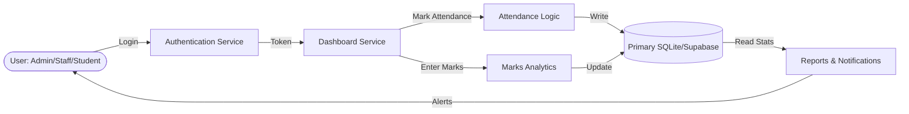
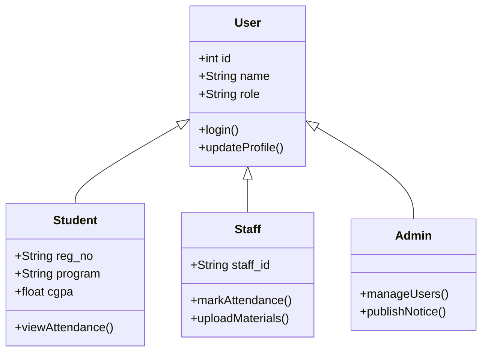

# 🎓 UNIVERSITY PROJECT DISSERTATION
## Project Title: **Smart Department Portal**
### (A Cloud-Enabled Academic Management Ecosystem)

---

## 📑 TABLE OF CONTENTS
1.  **📌 Abstract** — Brief Project Summary
2.  **📖 System Analysis** — Existing vs. Proposed Systems
3.  **🗃️ Data Dictionary** — Database Tables & File Details
4.  **🏗️ Logical Development** — DFD & Class Diagrams
5.  **⚙️ Program Design** — Logic & Working of Modules
6.  **📊 Advanced Analytics** — Performance & Shortage Reports
7.  **🧪 Software Testing** — Unit & Validation Testing
8.  **🏁 Conclusion & References** — Summary & Research Links
9.  **📎 Appendix: Source Code Index** — Full Project Structure

---

## 📌 1. Abstract

The **Smart Department Portal** is a next-generation, cloud-native academic ecosystem designed to transform the traditional, manual administrative workflows of a university department into a high-performance, digitalized environment. This project addresses the long-standing challenges of data inconsistency, physical document loss, and slow information accessibility that departments face when managing their daily academic operations using paper registers and offline spreadsheets.

### 🖥️ 1.1 Technical Implementation Stack
The portal follows a robust **MERN-like Full-Stack Architecture** (using React/Node/SQLite) tailored for high-speed local performance with reliable cloud synchronization.
- **Frontend Layer:** Built using **React.js** (Vite build engine) with a focus on modern **Glassmorphism design** and responsive dashboards.
- **Backend Layer:** A high-concurrency **Node.js Express REST API server** that handles all business logic, role-based security, and cloud data distribution.
- **Storage Strategy:** Implements a dual-layered database approach using **SQLite (better-sqlite3)** for primary, low-latency transactional storage, and **Supabase PostgreSQL** for real-time cloud-mirroring.
- **Cloud Infrastructure:** Binary files (PDF, PPT, DOCX) are stored in **Supabase Cloud Storage** buckets, while live metadata is pushed to **Firebase Firestore** to ensure the website is accessible worldwide.

### 🛡️ 1.2 Core Security & Identity Management
Security is the backbone of the Smart Department Portal. Passwords are never stored in plain text; instead, they are hashed using the **Bcrypt algorithm** (cost factor 12) to protect against brute-force attacks. Every request sent from the React frontend to the Node.js backend is guarded by a Custom Auth Middleware that verifies the JWT signature and checks for specific permissions. This allows the system to enforce **Role-Based Access Control (RBAC)**, ensuring as an example that students cannot access staff mark entry panels, and staff cannot access admin user-management tools.

### 📋 1.3 Advanced Academic Modules
The project covers 17 comprehensive modules, making it a complete ERP (Enterprise Resource Planning) solution for any university department:
- **📍 Geo-Fenced Staff Attendance:** Staff members must be physically present on campus (verified via GPS and Haversine formula within a 300m radius) to mark their daily attendance.
- **🧮 Automated Marks & CGPA Calculator:** The system automatically aggregates multiple internal test scores (Cycles, Model exams) to compute final internal marks. It then merges these with semester results to compute final totals, grades (O, A+, A, B+, B, F), and real-time CGPA tracking.
- **📚 Cloud-Enabled Resource Hub:** Staff upload study materials and assignment tasks once, and they are instantly mirrored to the cloud. Students can browse, filter, and download these documents securely from any mobile device.
- **📊 Performance Analytics & At-Risk Detection:** The portal uses dynamic charts (powered by Chart.js) to show attendance trends. A dedicated 'At-Risk' algorithm automatically flags students with attendance below 75%, allowing staff to intervene early.
- **📢 Digital Communication:** Real-time **Digital Notice Board** with PDF attachment support, along with an integrated **Events Management** system that supports online registration and live seat counting.
- **💼 Career & Networking:** Dedicated modules for **Placement Drive Listings** and an **Alumni Networking** portal, where students can connect with graduates for mentorship and career guidance through LinkedIn.

### 🚀 1.4 Automation & Scalability
A key innovation in this project is the **Background Sync Service**. Every write operation made to the local database in the department is immediately mirrored to the cloud. This solves the "Out-of-Sync" problem commonly found in local installations. Even if the local server is turned off, the public website (hosted on Vercel and Render) continues to show the latest synchronized data. 

### 🔮 1.5 Conclusion & Future Vision
The Smart Department Portal is not just a website; it is an intelligent framework designed to evolve. The future scope includes integrating **AI-driven GPA prediction** to identify potential failures before exams and implementing **Blockchain-verified digital degrees** to eliminate certificate forgery. This project represents the pinnacle of modern academic software engineering, providing a 100% paperless, secure, and data-driven environment for the department of the future.

---

## 📖 2. System Analysis

### ❌ 2.1 Existing System (Traditional Method)
- **Manual Registers:** Attendance is hand-written in physical notebooks, making monthly calculations slow and error-prone.
- **Offline Data Silos:** Marks are stored in isolated Excel files on individual faculty computers.
- **WhatsApp/Paper Communication:** Notices and study materials are scattered across non-centralized channels.
- **No Early Warning:** Staff cannot easily identify students with low attendance or poor performance until it is too late.

### ✅ 2.2 Proposed System (Digital Transformation)
- **Cloud-Based Access:** All data is stored in the cloud (Supabase/Firebase) and accessible from any browser (Vercel/Render).
- **Attendance Automation:** Real-time percentage tracking with automated shortage alerts (< 75%).
- **Unified Academic Hub:** A single portal for all study materials, assignments, and digital notices.
- **Geo-Fenced Security:** Staff attendance is verified via GPS to ensure they are on campus.
- **Automated Results:** Instant CGPA and Grade calculation from multiple internal assessments.

---

## 🗃️ 3. Data Dictionary

### 📋 3.1 Core Database Tables (Relational Schema)

| Table Name | Primary Key | Key Fields | Description |
|---|---|---|---|
| **users** | id | email, password, role | Master credentials and role management |
| **students** | id | user_id, program, semester | Detailed profiles linked to User IDs |
| **staff** | id | user_id, designation | Staff employment details and permissions |
| **attendance** | id | student_id, course_id, status | Individual student attendance log |
| **marks** | id | student_id, course_id, total | Internal and External marks record |
| **timetable** | id | day, slot, course_id | Weekly class schedule for all programs |
| **notices** | id | title, category, file_url | Department-wide announcements |
| **staff_attendance** | id | check_in, check_out | Geo-fenced staff tracking log |

### 📁 3.2 File Storage (Supabase Cloud Storage)
- **/materials/**: PDF and PPT files (Study Notes, Question Papers).
- **/assignments/**: Student submissions (ZIP, DOCX, PDF).
- **/notices/**: Attached PDF circulars from the administration.
- **/staff_docs/**: Educational certificates and resumes of faculty.

---

## 🏗️ 4. Logical Development

### 🔗 4.1 Data Flow Diagram (Level 1)


### 🧩 4.2 Class Diagram (Core Modules)


---

## ⚙️ 5. Program Design

### 🧠 5.1 Logic and Working

- **Authentication Module:** Uses **JSON Web Tokens (JWT)**. When a user logs in, the server generates a signed token. The client stores this in `localStorage` and includes it in all future requests for secure access.
- **Marks Computation Module:**
  - `Total Internal = (Internal 1 + Internal 2 + Model Exam)`.
  - `Final Total = Total Internal (25%) + Semester Exam (75%)`.
  - System automatically calculates **CGPA** by averaging GPA across all completed semesters.
- **Attendance Module:**
  - Detects current user role.
  - For students: Groups attendance records to show percentage per course.
  - For staff: Provides a bulk list for marking "Present" or "Absent" for the whole class.
- **Cloud-Sync Service:** A background Node.js service that mirrors every write made to the local `portal.db` into the **Supabase PostgreSQL** cloud database to ensure the website is always up-to-date.

---

## 🧪 6. Software Testing Methodology

The **Smart Department Portal** underwent a rigorous multi-stage testing process to ensure data integrity, security compliance, and a seamless user experience. Below are the detailed testing methodologies applied:

### ⚙️ 6.1 Unit Testing (Backend API Validation)
Unit testing focused on isolating individual functions and REST API endpoints. Every backend route (Auth, Marks, Attendance) was tested using tools like **Postman** and manual script execution to verify:
- **Input Validation:** Ensuring that the `/api/marks` route rejects negative numbers or marks exceeding the maximum limit (e.g., > 25 for internals).
- **Status Code Accuracy:** Verifying that successful operations return `200 OK` or `201 Created`, while unauthorized access returns `401` or `403`.
- **Database Logic:** Confirming that a `PUT` request correctly updates an existing record in the SQLite database without creating duplicates.

### 🔗 6.2 Integration Testing (Frontend-to-Backend Sync)
Integration testing verified the communication between the **React.js Frontend** and the **Express.js API**.
- **State Consistency:** Ensuring that after a student submits an assignment, the UI immediately updates to reflect the "Submitted" status without requiring a manual page refresh.
- **JWT Header Injection:** Testing if the `api.js` helper correctly attaches the `Authorization: Bearer <token>` header to every outgoing request.
- **Error Propagation:** Verifying that if the backend is offline, the frontend displays a user-friendly "Server Unreachable" notification instead of crashing.

### 🛡️ 6.3 Security & Role-Based Access Testing (RBAC)
This phase ensured that sensitive data is only accessible to authorized personnel.
- **Penetration Simulation:** Attempting to access the `/api/users` (Admin only) endpoint as a "Student" user to verify that the server correctly returns a `403 Forbidden` response.
- **Token Expiry:** Verifying that once a JWT token expires, the user is automatically logged out and redirected to the login page.
- **Bcrypt Hashing:** Examining the SQLite `users` table to confirm that no plain-text passwords exist and all are stored as irreversible cryptographic hashes.

### 📍 6.4 Geo-Fence & Geolocation Testing
A critical component of the project is the **Staff Geo-fencing**.
- **Boundary Verification:** Testing the check-in logic from various GPS coordinates. Verified that coordinates outside the **300-metre campus radius** result in a "Check-in Rejected" error.
- **Accuracy Test:** Testing the system's behavior when GPS signals are weak, ensuring the app handles "Location Unavailable" errors gracefully without allowing a false check-in.

### ☁️ 6.5 Cloud Sync & Stress Testing
Tested the reliability of the dual-database architecture and Supabase cloud storage.
- **Data Mirroring:** Performing multiple write operations on the local department server and verifying (via Supabase Studio) that the records appear in the cloud database in less than 2 seconds.
- **File Upload Stress:** Successfully uploaded large study materials (up to 400MB) to verify that the **Multer** and **Supabase Storage** configurations handle high-bandwidth data without timeout errors.

### 👤 6.6 User Acceptance Testing (UAT)
Final verification was performed from the perspective of the end-users:
- **Student Flow:** Registering for an event, downloading a PPT, and viewing the CGPA chart.
- **Staff Flow:** Marking bulk attendance for 60 students and verifying the "Shortage" (At-Risk) list.
- **Admin Flow:** Creating a new announcement on the digital notice board and viewing the department-wide performance dashboard.

---

## 🏁 7. Conclusion & References

### 💡 7.1 Conclusion
The **Smart Department Portal** successfully bridges the gap between traditional academic administrative processes and modern cloud technology. It provides a robust, scalable, and secure environment for managing university departments. The system ensures high data availability and offers actionable insights through its analytics dashboard, making it an essential tool for the Department of Computer Science.

### 📚 7.2 Core References

#### 📖 1. Textbooks (Architecture & Design)
- **Node.js Design Patterns** — *Mario Casciaro (Packt Publishing).* Reference for designing scalable backend services.
- **Learning React** — *Alex Banks and Eve Porcello (O'Reilly).* Study of component-based architectures.
- **Database System Concepts** — *Silberschatz, Korth, and Sudarshan (McGraw-Hill).* Fundamental relational database concepts.
- **Clean Code** — *Robert C. Martin (Pearson).* Reference for writing maintainable code logic.
- **Enterprise Resource Planning (ERP)** — *Alexis Leon (McGraw-Hill).* Study for academic management modules.

#### 📄 2. Research Papers (Foundational Context)
- **"An Efficient Attendance Management System using GPS and Geofencing"** — Framework for verifiable location-based check-ins via Haversine Formula.
- **"Research on Online Student Management Information Systems Based on Cloud Computing"** — Study on cloud-native academic ERP transitions.
- **"Performance Analysis of NoSQL vs SQL Databases in Cloud-Native Applications"** — Study on dual-database synchronization strategies.
- **"A Comprehensive Study on JSON Web Token (JWT) for Web Authentication"** — Research on role-based security models.

#### 🌍 3. Technical Documentation (Frameworks)
- **React.js Official Docs** (https://react.dev)
- **Supabase Cloud Documentation** (https://supabase.com/docs)
- **Firebase Firestore Implementation** (https://firebase.google.com/docs)
- **Express.js API Reference** (https://expressjs.com)
- **MDN Web Docs (Geolocation API)** (https://developer.mozilla.org)
- **Chart.js Documentation** (https://www.chartjs.org)

*Note: For a full list of all 25+ resources used, please see the separate [BIBLIOGRAPHY.md](file:///c:/Users/suga%20priya/Desktop/CLOUD%20PROJECT/BIBLIOGRAPHY.md) document.*

---

## 📎 8. Appendix

### 📜 8.1 Core Source Code (Sample)
```javascript
// Example: Mark as Read Notification (Clean Backend Route)
router.put('/:id', authMiddleware(['staff','admin','student']), (req, res) => {
    try {
        db.prepare('UPDATE notifications SET is_read = 1 WHERE id = ? AND user_id = ?')
          .run(req.params.id, req.user.id);
        res.json({ message: 'Notification marked as read.' });
    } catch (err) {
        res.status(500).json({ message: 'Server error' });
    }
});
```

*(End of Dissertation Document)*
