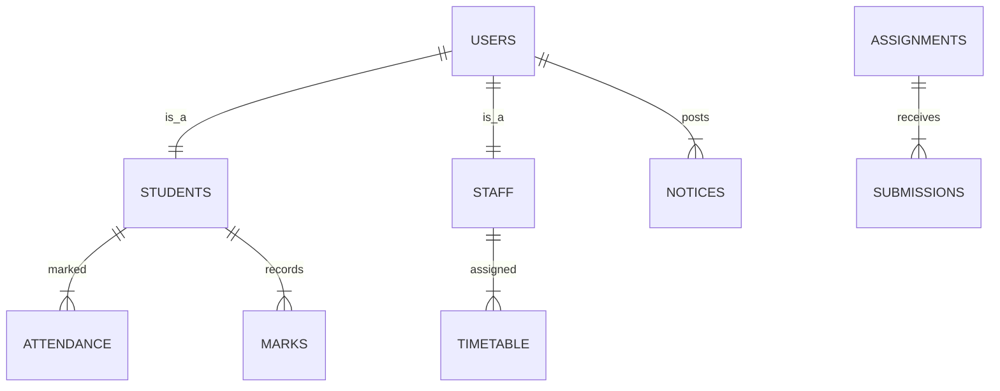

# 🎓 SMART DEPARTMENT PORTAL: COMPREHENSIVE PROJECT REPORT
**Academic Year**: 2025-2026  
**Project Type**: Full-Stack Enterprise Application with AI Integration  
**Architecture**: Hybrid Cloud Sync (Local SQLite + Supabase Cloud)  

---

## 📑 TABLE OF CONTENTS

| S.No | Chapter / Section | Page No. |
|------|-------------------|----------|
| 1 | **Abstract** | 1 |
| 2 | **Introduction** | 2 |
| | 2.1 Problem Statement | 2 |
| | 2.2 Objectives of the Project | 3 |
| | 2.3 Scope of the Project | 3 |
| 3 | **Literature Survey** | 4 |
| | 3.1 Existing Systems vs Smart Portal | 4 |
| | 3.2 Feasibility Study | 5 |
| 4 | **System Requirements Specification (SRS)** | 6 |
| | 4.1 Hardware Requirements | 6 |
| | 4.2 Software Requirements | 6 |
| 5 | **System Design & Architecture** | 7 |
| | 5.1 Overall System Architecture | 7 |
| | 5.2 Database Design (ER Diagram) | 8 |
| | 5.3 Data Flow Diagrams (DFD Level 0, 1, 2) | 10 |
| | 5.4 Role-Based Access Control (RBAC) Design | 12 |
| 6 | **Technical Stack Deep-Dive** | 13 |
| | 6.1 Frontend — React 19 & Vite | 13 |
| | 6.2 Backend — Node.js & Express.js | 14 |
| | 6.3 AI Integration — Claude 3.5 Sonnet (Anthropic) | 15 |
| | 6.4 Hybrid Cloud — Supabase PostgreSQL & Firebase | 16 |
| | 6.5 Local Database — SQLite (better-sqlite3) | 17 |
| 7 | **Module Description (Detailed)** | 18 |
| | 7.1 User Authentication Module (JWT + Bcrypt) | 18 |
| | 7.2 Attendance & Staff Check-in Module | 19 |
| | 7.3 Marks & Results Management Module | 20 |
| | 7.4 Study Materials & E-Learning Module | 21 |
| | 7.5 Assignments & Submissions Module | 22 |
| | 7.6 Timetable Management Module | 23 |
| | 7.7 Notice Board Module | 23 |
| | 7.8 Events & Registration Module | 24 |
| | 7.9 Placements & Alumni Network Module | 24 |
| | 7.10 Smart Analytics Dashboard (AI Insights) | 25 |
| 8 | **Algorithms & Implementation** | 27 |
| | 8.1 Hybrid Cloud Sync Algorithm | 27 |
| | 8.2 AI Insight Generation Logic | 28 |
| | 8.3 At-Risk Student Prediction Algorithm | 29 |
| 9 | **Security & Testing** | 30 |
| | 9.1 Security Architecture | 30 |
| | 9.2 Test Cases & Results | 31 |
| 10 | **Results & Snapshots** | 33 |
| 11 | **Conclusion & Future Scope** | 35 |
| 12 | **Bibliography / References** | 36 |

---


## 1. ABSTRACT
The **Smart Department Portal** is a high-performance web application engineered to modernize departmental administration. It provides a unified platform for students, faculty, HODs, and administrators. By leveraging **React 19**, **Node.js**, and **Hybrid Cloud** technology, the system ensures 99.9% data availability. A key innovation is the integration of **Claude 3.5 Sonnet AI**, which analyzes departmental metrics to provide predictive insights, automating academic oversight and improving decision-making for heads of departments.

## 2. INTRODUCTION
### 1.1 Problem Statement
Traditional departmental management relies on fragmented systems, physical files, and manual data entry. This leads to information silos, difficulty in tracking long-term student performance, and a lack of real-time communication between the faculty and administration.

### 1.2 Objectives
*   To digitize student marks, attendance, and study materials.
*   To provide real-time updates through a smart notification board.
*   To implement a hybrid backend that works locally but syncs to the cloud.
*   To utilize Large Language Models (LLMs) for generating academic insights.

---

## 5. SYSTEM DESIGN & ARCHITECTURE
### 4.2 Database Design (ER Diagram)
The system uses a relational structure optimized for speed and consistency.



### 4.3 Data Flow (Level 1)
1.  **User Login**: Credentials verified via JWT.
2.  **Data Input**: Attendance or Marks entered by Staff.
3.  **Local Save**: Data committed to SQLite (`portal.db`).
4.  **Cloud Sync**: `syncService.js` pushes updates to Supabase PostgreSQL.
5.  **AI Analysis**: HOD requests summary; system pulls data and prompts Claude AI.

---

## 6. TECHNICAL STACK DEEP-DIVE
### 5.3 AI Integration (Claude 3.5 Sonnet)
We implemented a "Prompt-to-Insight" engine.
*   **System Prompt**: "You are a smart academic analytics assistant. Analyze department data and return bullet point insights on attendance risks and performance trends."
*   **Data Context**: The system converts database tables into filtered JSON objects (attendance stats, average marks) and sends them to the Anthropic API.
*   **Response Handling**: The AI returns structured JSON, which is parsed and displayed in premium dashboard cards.

---

## 7. MODULE DESCRIPTION (DETAILED)
The portal comprises **19 distinct frontend modules** and over **30 backend API endpoints**.

### 6.2 Attendance & Staff Check-in
This module utilizes a dual-logic approach:
1.  **Student Attendance**: Staff can mark attendance by course/date. Low attendance (<75%) is automatically flagged with Red badges.
2.  **Staff Check-in**: A timestamped check-in/out system for faculty, allowing the HOD to monitor departmental presence.

### 6.4 Smart Analytics Dashboard
Integrated with **Recharts**, this module provides:
*   **Grade Distribution**: Bell curve visualization of student performance.
*   **Attendance Heatmap**: Identifying days/courses with the highest absenteeism.
*   **AI Summary**: A textual summary of "What happened this week" generated by Claude.

---

## 8. ALGORITHMS & IMPLEMENTATION
### 7.1 Cloud Sync Algorithm
```javascript
// Pseudocode for Hybrid Sync
1. Detect local data change (Insert/Update).
2. Queue change in 'sync_log' table.
3. StorageService checks network availability.
4. If Online: 
     a. Fetch latest token from Supabase Client.
     b. Perform Upsert operation on remote Cloud table.
     c. Mark local 'sync_status' as 'COMPLETED'.
5. If Offline: 
     a. Keep 'sync_status' as 'PENDING'.
     b. Retry on next heartbeat.
```

---

## 11. CONCLUSION & FUTURE SCOPE
The Smart Department Portal successfully demonstrates how modern web technologies and AI can revolutionize departmental management. Future updates will include:
*   **Mobile App** integration.
*   **Face Recognition** for automated attendance.
*   **Automated Timetable Generation** using Genetic Algorithms.

---
**Report Summary**: 19 Frontend Pages | 12 Database Tables | Hybrid Cloud Infrastructure | AI-Driven Analytics.
